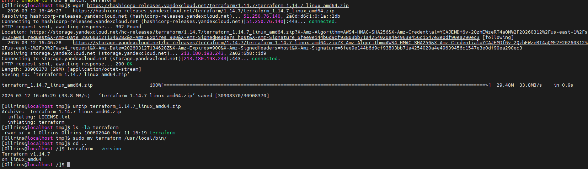
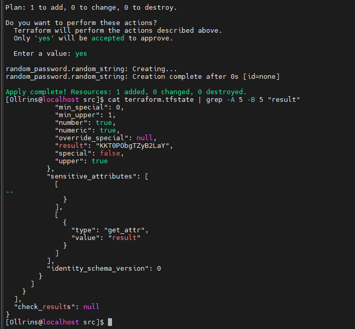
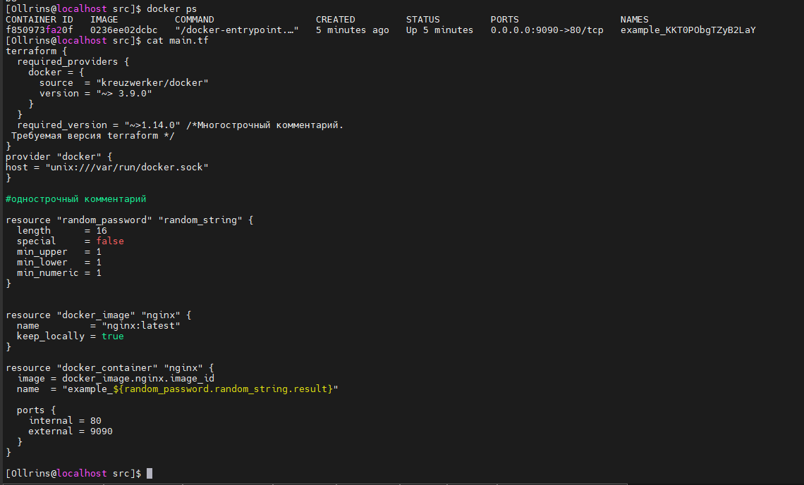
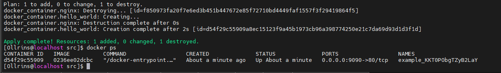
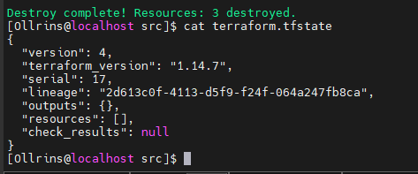
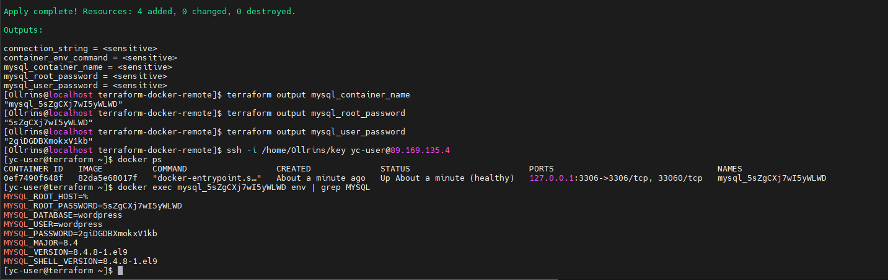

# Домашнее задание к занятию «Введение в Terraform»

## Задание 1
<p align="center">
  
  <br>
  <em>Рисунок  - Terraform установка </em>
</p>

###  1.2 
В файле .gitignore указана строка:
```bash
#own secret vars store.
personal.auto.tfvars
```
Cогласно данному файлу, для хранения личной, секретной информации (логинов, паролей, ключей, токенов) предназначен файл personal.auto.tfvars. <br>
Он явно указан в .gitignore — это значит, что он не будет попадать в коммиты и, соответственно, в удалённый репозиторий GitHub. <br>

### 1.3
<p align="center">
  
  <br>
  <em>Рисунок  - state-файл, содержимое созданного ресурса random_password - "result": "KKT0PObgTZyB2LaY" </em>
</p>

### 1.4
Намеренно допущенные ошибки в коде были: <br>
- пропущенное имя ресурса <br>
- имя ресурса, начинающееся с цифры <br>
- неправильная ссылка на другой ресурс (с опечаткой) <br>
- опечатка в атрибуте result <br>
### 1.5
<p align="center">
  
  <br>
  <em>Рисунок  -  исправленный фрагмент кода и вывод команды </em>
</p>

### 1.6 terraform apply с ключом -auto-approve

Terraform определит, что старый ресурс docker_container.nginx нужно удалить, а новый docker_container.hello_world — создать. <br>
Ключ -auto-approve автоматически подтверждает выполнение без запроса yes. Это опасно, потому что: <br>
- непреднамеренное удаление ресурсов — можно случайно уничтожить данные <br>
- нет возможности проверить план — неизвестно, что именно изменится <br>
- каскадные изменения — одно изменение может повлечь удаление связанных ресурсов <br>
- в продакшене критично — в реальной инфраструктуре такие автоматические подтверждения могут привести к простою <br>

Несмотря на риски, -auto-approve полезен в некоторых ситуациях: <br>

- CI/CD пайплайны — в автоматических скриптах, где нет интерактивного ввода <br>
- тестовые среды — где можно быстро пересоздавать инфраструктуру <br>
- скрипты и автоматизация — когда нужно выполнить изменения без участия человека <br>
- обучение и эксперименты — для быстрого применения учебных конфигураций <br>

  <p align="center">
  
  <br>
  <em>Рисунок  - вывод команды docker ps</em>


### 1.7
<p align="center">
  
  <br>
  <em>Рисунок  - содержимое файла terraform.tfstate</em>

### 1.8 
В файле main.tf в ресурсе docker_image.nginx есть важный параметр:
```bash
hcl
resource "docker_image" "nginx" {
  name         = "nginx:latest"
  keep_locally = true  
}
```
Параметр keep_locally = true означает: "сохранить образ локально после уничтожения ресурса". <br>

Подтверждение из документации провайдера Docker <br>
"keep_locally (Boolean) If true, the image will be kept when the resource is destroyed. If false, it will be removed from the local Docker host. Defaults to false." <br>
Поведение по умолчанию (false) означало бы полное удаление образа. Установлен keep_locally = true, чтобы: <br>
- экономить трафик — при следующем запуске не придётся качать образ заново <br>
- ускорить повторное создание — образ уже есть локально <br>
- сохранить кастомные образы — если бы нужно было создать свой образ на основе nginx <br>

## Задание 2

  <p align="center">
  
  <br>
  <em>Рисунок  - наличие секретных env-переменных с помощью команды env ps</em>


Скачивание Terraform с зеркала Яндекса
```bash
wget https://hashicorp-releases.yandexcloud.net/terraform/1.14.7/terraform_1.14.7_linux_amd64.zip
unzip terraform_1.14.7_linux_amd64.zip
sudo mv terraform /usr/local/bin/
terraform --version
```
Скачивание и установка провайдера Docker
```bash
wget https://github.com/kreuzwerker/terraform-provider-docker/releases/download/v3.9.0/terraform-provider-docker_3.9.0_linux_amd64.zip
unzip terraform-provider-docker_3.9.0_linux_amd64.zip -d ~/.terraform.d/plugins/registry.terraform.io/kreuzwerker/docker/3.9.0/linux_amd64/
chmod +x ~/.terraform.d/plugins/registry.terraform.io/kreuzwerker/docker/3.9.0/linux_amd64/terraform-provider-docker*
```
1.4 Скачивание и установка провайдера Random
```bash
wget https://hashicorp-releases.yandexcloud.net/terraform-provider-random/3.6.0/terraform-provider-random_3.6.0_linux_amd64.zip
unzip terraform-provider-random_3.6.0_linux_amd64.zip -d ~/.terraform.d/plugins/registry.terraform.io/hashicorp/random/3.6.0/linux_amd64/
chmod +x ~/.terraform.d/plugins/registry.terraform.io/hashicorp/random/3.6.0/linux_amd64/terraform-provider-random*
```
